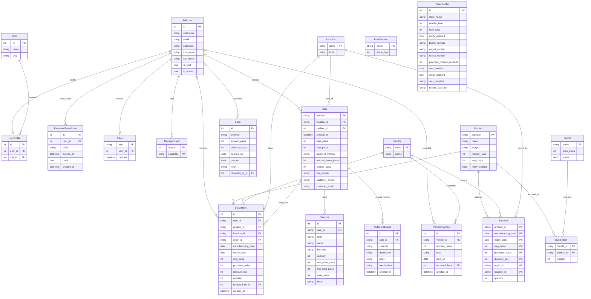

# Mudi ER diagram

Money is stored as paisa. A stock batch is identified by the product, dates, prices, discount, source, and place together.

```mermaid
erDiagram
    AuthUser ||--o| UserProfile : profile
    Role ||--o{ UserProfile : assigned
    AuthUser ||--o{ PasswordResetCode : reset_codes
    AuthUser ||--o| Token : session
    AuthUser ||--o{ ManagerGrant : jobs
    AuthUser |o--o{ StockMove : recorded
    AuthUser |o--o{ Sale : cashier
    AuthUser |o--o{ VendorPayment : recorded
    AuthUser |o--o{ Loan : recorded

    AuthUser {
        int id PK
        string username
        string email
        string password
        string first_name
        string last_name
        bool is_staff
        bool is_active
    }
    Role {
        int id PK
        string name
        string slug
    }
    UserProfile {
        int id PK
        int user_id FK
        int role_id FK
    }
    PasswordResetCode {
        int id PK
        int user_id FK
        string code
        datetime expires_at
        bool used
        datetime created_at
    }
    Token {
        string key PK
        int user_id FK
        datetime created
    }
    ManagerGrant {
        int user_id PK
        string capability PK
    }

    Product ||--o{ StockLot : batches
    Vendor ||--o{ StockLot : source
    Location ||--o{ StockLot : stored_at
    Product ||--o{ StockMove : movement
    Vendor ||--o{ StockMove : source
    Location ||--o{ StockMove : place
    Sale |o--o{ StockMove : sold_from
    Product ||--o{ BundleItem : included_in
    Bundle ||--o{ BundleItem : contains
    Location ||--o{ Sale : sold_at
    Sale ||--o{ SaleLine : lines
    Sale ||--o{ OutboundNotice : receipt_notices
    Vendor ||--o{ VendorPayment : payments

    Product {
        string barcode PK
        string name
        string image
        int reorder_level
        int lead_days
        bool notify_enabled
    }
    StockLot {
        string product_id PK
        date manufacturing_date PK
        date expiry_date PK
        int mrp_paisa PK
        int purchase_paisa PK
        int discount_bps PK
        string origin_id PK
        string location_id PK
        int quantity
    }
    StockMove {
        int id PK
        string sale_id FK
        string product_id FK
        string location_id FK
        string origin_id FK
        date manufacturing_date
        date expiry_date
        int mrp_paisa
        int purchase_paisa
        int discount_bps
        int quantity
        int recorded_by_id FK
        datetime created_at
    }
    Location {
        string name PK
        string kind
    }
    Vendor {
        string name PK
        string phone
    }
    Bundle {
        string name PK
        int price_paisa
        bool active
    }
    BundleItem {
        string bundle_id PK
        string product_id PK
        int quantity
    }
    Sale {
        string number PK
        string location_id FK
        int cashier_id FK
        datetime created_at
        int total_paisa
        int cost_paisa
        string payment_method
        int amount_taken_paisa
        int change_paisa
        string txn_number
        string customer_phone
        string customer_email
    }
    SaleLine {
        int id PK
        string sale_id FK
        string kind
        string name
        string barcode
        int quantity
        int unit_price_paisa
        int line_total_paisa
        int cost_paisa
        string detail
    }
    OutboundNotice {
        int id PK
        string sale_id FK
        string channel
        string destination
        string body
        string mechanism
        datetime created_at
    }
    VendorPayment {
        int id PK
        string vendor_id FK
        int amount_paisa
        string note
        date paid_on
        int recorded_by_id FK
        datetime created_at
    }
    Loan {
        int id PK
        string borrower
        int amount_paisa
        int collected_paisa
        date opened_on
        date due_on
        string note
        int recorded_by_id FK
    }
    ProfitPartner {
        string name PK
        int share_bps
    }
    StoreConfig {
        int id PK
        string store_name
        int reorder_level
        int lead_days
        bool notify_enabled
        string bkash_number
        string nagad_number
        string rocket_number
        int payment_timeout_seconds
        bool sms_enabled
        bool email_enabled
        string sms_template
        string receipt_base_url
    }
```
